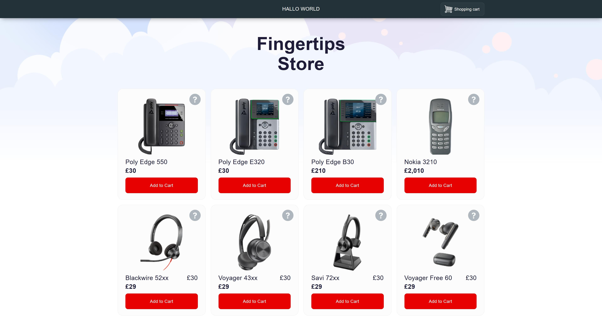
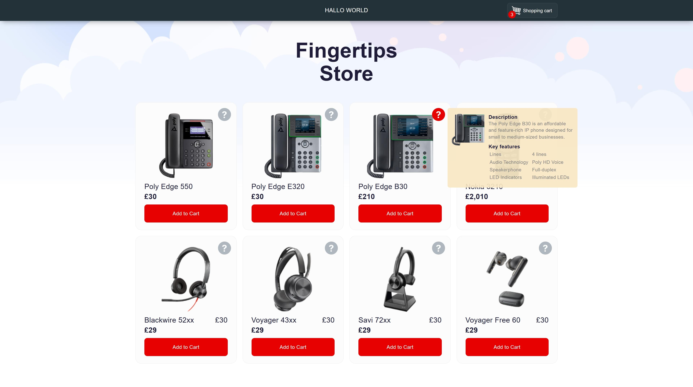
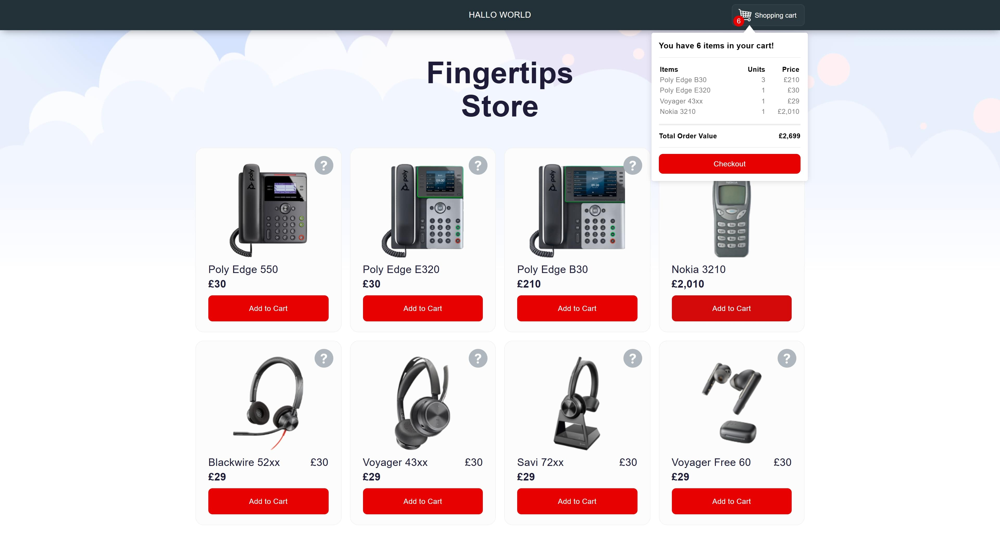

# Vodafone store

A React + Vite application simulating a basic online store.

## Overview

Vodafone Store is a simple React application featuring a static product listing page with cart functionality. Built according to the following requirements:

- **Product Listing Page:** Displays a list of static products.
- **Product Information Tooltip:** Hovering the "?" icon shows more details about each product.
- **Add to Cart:** Adds the product to the cart, increasing the amount if the product is added multiple times.
- **Cart Overview:** Clicking the "Shopping Cart" button displays the list of items in the cart, their quantities, and the total value.

## Tech Stack

- [React](https://react.dev/)
- [Vite](https://vitejs.dev/)
- JavaScript (ES6+)

### Installation

1. Install dependencies:

   ```bash
   npm install
2. Run the development server:

   ```bash
   npm run dev
## Screenshots

Listing the products 


The product informations


The cart functionality
